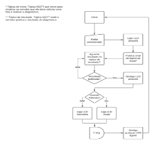
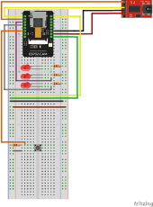
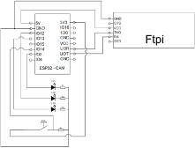

# Descrição

Este projeto tem como proposta lembrar o usuário de utilizar a máscara corretamente em
onde quer que o circuito esteja posicionado, desde que a lente de sua câmera esteja
apontada para o rosto do usuário. A interação deve levar poucos segundos, onde o usuário
pressiona o botão do dispositivo, que tira uma foto e se comunica com o servidor que irá
aplicar uma rede neural convolucional (CNN, da sigla em inglês) e publicará o resultado
com a informação de que uma máscara está sendo usada corretamente ou não.

# Componentes, meios de comunicação e ferramentas

## ESP32-CAM

A plataforma escolhida para ser o núcleo da solução foi um ESP32-CAM. Esse
dispositivo possui duas características de grande valia para o projeto, que são o WiFi
embutido e o suporte a câmera sem extensas conexões de pinos e configurações adicionais.
Seu ponto negativo é a ausência de entrada USB de qualquer tipo, necessitando de um
conversor USB serial para que o software requerido seja gravado na placa. (FilipeFlop,
2019).

## Módulo de câmera OV2640 2MP

Módulo responsável por capturar a imagem. No projeto é um dos principais
dispositivos de entrada, pois ele que irá capturar a informação necessária para que a rede
neural possa diagnósticar o uso correto de máscara ou não.

## Conversor USB Serial FTDI FT232RL

Devido a inexistência de portas USB no ESP32-CAM, se faz necessário o uso de um
intermediário entre o ambiente de desenvolvimento e a placa. O conversor escolhido foi o
FTDI FT232RL, que faz a gravação na placa através das entradas RX e TX, como também
faz a alimentação tanto por 5V quanto por 3.3V.

## Botão

Esse será o componente de gatilho que iniciará todo o algoritmo do diagnóstico. Ao ser
pressionado, deverá sinalizar que a rotina de detecção de máscara deve ser iniciada.

## LEDs

Como forma de visualizar o estado do sistema serão utilizados LEDs de cores diferentes.
As três cores escolhidas serão vermelho, amarelo e verde, representando a ausência ou uso
incorreto de máscara, detecção em progresso e uso correto, respectivamente.

## Ambiente de desenvolvimento

Como ambiente de desenvolvimento a IDE oficial do Arduino foi escolhida, como
biblioteca adicional para controle do ESP32-CAM, a biblioteca comunitária esp32cam.

##  Protocolos de comunicação

### HTTP

Protocolo que proporciona a troca de recursos entre um destinatário e um remetente.
A requisição sempre é feita pelo remetente e o destinatário provê o que é solicitado.

No projeto, o ESP32-CAM irá prover um servidor que ao receber uma requisição de
GET em determinada rota, retornará a imagem capturada naquele instante como mensagem
de resposta.

### MQTT

Protocolo em que um servidor ( _broker_ ) possui tópicos que recebem inscrições e
publicações. O cliente que estiver inscrito em um tópico recebe as publicações do mesmo.
Esse protocolo de mensageria foi desenhado para ser leve e de baixo consumo de rede e de
processamento, tornando-se uma ótima escola para IoT.

Esse protocolo será utilizado como ponto de início do diagnóstico e fim. A
publicação do sinal de início de diagnóstico será feita em um tópico em que o servidor
estará inscrito. Essa sinalização fará o servidor executar seu algoritmo de detecção e
publicar em um outro tópico do resultado como usando máscara ou não.

## Rede Neural

A rede neural utilizada faz uso da linguagem Python e das bibliotecas Keras e
OpenCV. A modelagem e treinamento da rede neural é resultado do estudo do Balaji S
em seu repositório.

# Diagramas

## Fluxo Lógico

## Desenho esquemático na placa de ensaio

## Circuito Eletroeletrônico

## Demonstração, montagem e uso do código

Um vídeo demonstrando o uso real do projeto já concluído pode ser encontrado em:
https://youtu.be/C1IPtrvxXQQ. No mesmo está incluso uma explicação da estrutura do
código fonte, os componentes e a comunicação realizada, de uma forma resumida.

